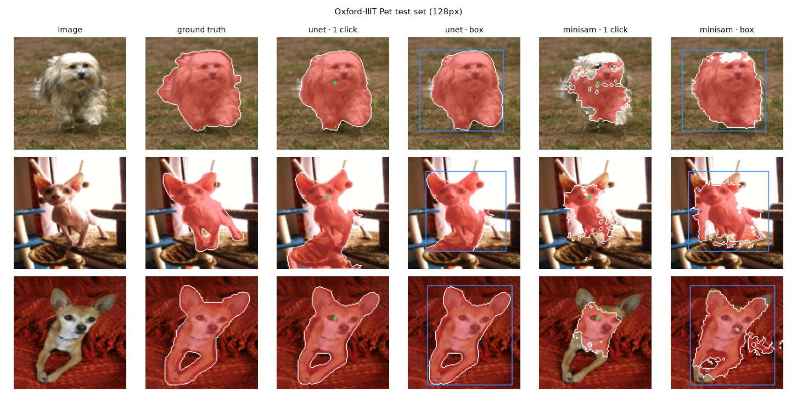

# boundaryBrush

Promptable segmentation — click on something (or draw a box) and get its mask — with **three
backends behind one predictor API**:

| Backend | What it is | Prompts |
|---|---|---|
| `unet` | plain U-Net (1.9M params) trained here | none needed; a click picks the connected blob under it |
| `minisam` | a small Segment-Anything-style model written from scratch and trained here | clicks (include/exclude) and boxes |
| `slimsam` | pretrained SlimSAM (a 9.7M-param pruned SAM) via 🤗 transformers | clicks and boxes, on anything |

Everything trains on a 2015 MacBook Pro CPU (Oxford-IIIT Pet, 128 px). It is also the segmentation
engine for [illusionFrame](../010-illusionFrame): click the figure in a painting, mutate only it.

## Results — a short pass on a 2015 laptop CPU

The first 100 Oxford-IIIT Pet test images at 128 px, same simulated user for every backend
([`results/`](results/); U-Net trained 30 epochs, best at epoch 30; mini-SAM stopped after 3 of 30
planned epochs to keep the whole run short).

| | IoU, 1 click | IoU, 5 clicks | NoC@85 (↓, max 5) | IoU, box | Boundary IoU, 1 click | No prompt | s / image |
|---|---|---|---|---|---|---|---|
| U-Net | **0.801** | 0.625 | **2.76** | **0.831** | **0.453** | 0.819 | 4.5 |
| mini-SAM (3 epochs) | 0.550 | 0.676 | 4.85 | 0.721 | 0.142 | — | 5.7 |
| SlimSAM (pretrained) | 0.643 | 0.711 | 4.44 | 0.701 | 0.212 | — | 35.2 |



What this shows, honestly:

- **The U-Net is the strongest here** — it was trained to exactly this task (one pet, 128 px). But
  it cannot *refine*: extra clicks can only pick or delete whole blobs, so a corrective click that
  lands on a spurious region attached to the pet deletes the pet too (IoU falls from 0.80 after one
  click to 0.62 after five).
- **The mini-SAM behaves like a promptable model** — its IoU rises with every click (0.55 → 0.68)
  and a box helps a lot (0.72) — but after 3 epochs its masks are patchy. Its validation score was
  still climbing when the run was cut; `make train-minisam` finishes the 30-epoch schedule
  (≈ 3–5 h on this CPU).
- **SlimSAM is handicapped by the protocol**: it is fed 128 px images upscaled to 1024 px, far
  from the photos SAM is built for, and it costs ~35 s per image here. Treat its numbers as a lower
  bound, not as SAM's quality.


## Use

```bash
make install                 # uv sync --extra all (the [sam] extra adds transformers for SlimSAM)
make data                    # downloads Oxford-IIIT Pet (~800 MB) and caches 128px tensors
make train-unet EPOCHS=30    # resumable: rerun with --resume after an interruption
make train-minisam

uv run boundarybrush eval unet            # results/eval_unet.json
uv run boundarybrush predict photo.jpg -b minisam --click 120,80 --click 30,40:0 -o out/
uv run boundarybrush click photo.jpg -b slimsam   # left click include, right click / n exclude, r reset, s save
uv run boundarybrush fetch-weights        # released U-Net and mini-SAM weights, SHA-256 checked
```

```python
from boundarybrush import Prompt, get_segmenter

seg = get_segmenter("minisam")           # "unet", "slimsam", "mock"
seg.set_image(rgb)                        # H x W x 3 uint8 — embedded once
result = seg.predict(Prompt(points=[(120, 80), (30, 40)], labels=[1, 0]))
result.mask, result.score                 # bool H x W at the image's size, predicted quality
```

## How the mini-SAM works

A small version of [Segment Anything](https://arxiv.org/abs/2304.02643)'s design:

```
image 128² ─► residual CNN (stride 8) ─► 16×16×128 tokens ─► self-attention (global context)
clicks/box ─► shared Fourier position encoding + token type (include / exclude / box corner / pad)
decoder: two-way attention between [IoU token, mask token, prompt tokens] and image tokens
mask: upscale ×4, add a stride-2 encoder skip (as in SAM-HQ), dot with the mask token's MLP ─► logits
```

- **The prompt really decides**: Pets has one animal per image, so training pastes a second pet into
  half the images and the click has to choose which one to segment.
- Training prompts imitate how people correct a mask: a first click inside the object, then extra
  clicks, with exclusions half the time hugging the object's edge; jittered boxes; box + clicks.
- The Oxford "border" band (pixels the annotators left undecided) is down-weighted in the loss rather
  than trusted.
- Coordinates are pixel-centred (x, y); padding tokens are masked out of attention (a port of an older
  mini-SAM treated them as positive clicks at the corner).

## Evaluation protocol

Same 128 px test images and the same deterministic simulated user for every backend: click 1 at the
point deepest inside the object; each next click at the deepest point of the larger error region
(missed object → include, spurious region → exclude). Reported: IoU after 1–5 clicks, NoC@85 (clicks
to reach 85% IoU, max 5), IoU from the tight box, Boundary IoU (IoU of the 2%-of-diagonal band along
the edges), and for the U-Net IoU with no prompt at all. SlimSAM is scored on the first 100 test images
(its 1024 px embedding takes about a minute per image on this CPU) and sees 128 px images upscaled —
a lower bound on what it does at full resolution.

## Limits

- 128 px masks look soft when upscaled to large images (e.g. projector resolution).
- Oxford-IIIT Pet images are CC BY-SA 4.0 with their owners' copyright; the figures here show test
  images for illustration.

## License

MIT (code). SlimSAM weights: see the model card of `nielsr/slimsam-77-uniform`.
